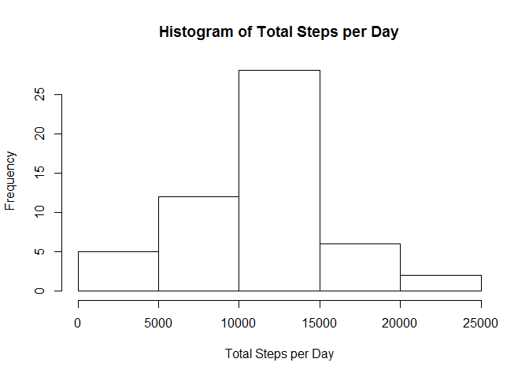
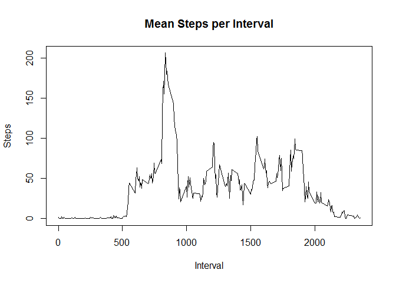
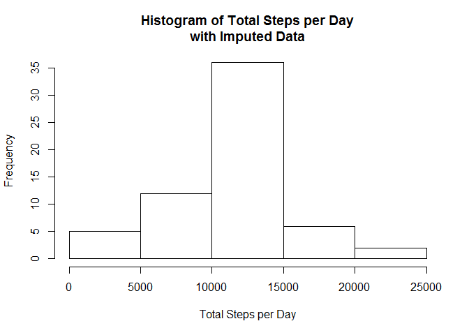

# Reproducible Research: Peer Assessment 1
This is my first attempt at using R Markdown to generate a document in the literate programming style.  In this exercise, we will provide some simple analyses of data from a personal activity monitoring device.

## Loading and preprocessing the data
First, let's load the data into R.  We'll read directly from the zipped file.

```r
rawData <- read.csv(unz("activity.zip", "activity.csv"))
```
Now, let's get a feel for the data.  The *dim* function tells us the size of the dataset.

```r
dim(rawData)
```

```
## [1] 17568     3
```
And *head* shows us the first few observations.

```r
head(rawData)
```

```
##   steps       date interval
## 1    NA 2012-10-01        0
## 2    NA 2012-10-01        5
## 3    NA 2012-10-01       10
## 4    NA 2012-10-01       15
## 5    NA 2012-10-01       20
## 6    NA 2012-10-01       25
```

## What is mean total number of steps taken per day?
Next, *tapply* can calculate the total steps taken each day, and *hist* can summarize the results in a histogram.

```r
totalStepsPerDay <- with(rawData, tapply(steps, date, sum))
hist(totalStepsPerDay, main="Histogram of Total Steps per Day", xlab="Total Steps per Day")
```

<!-- -->

Now, let's calculate the mean and median of the total steps taken each day.

```r
sprintf("%.0f", mean(totalStepsPerDay, na.rm=TRUE))
```

```
## [1] "10766"
```
As shown above, the mean is 10766.

```r
sprintf("%.0f", median(totalStepsPerDay, na.rm=TRUE))
```

```
## [1] "10765"
```
The median is 10765.

## What is the average daily activity pattern?
Let's look at steps averaged by interval across days.  This will give us an idea of activity in a typical day.  Once again, *tapply* is a handy tool.  We'll show the results in a time-series plot.

```r
meanStepsPerInterval <- with(rawData, tapply(steps, interval, mean, na.rm=TRUE))
xTicks <- as.numeric(names(meanStepsPerInterval))
plot(xTicks, meanStepsPerInterval, type="l", ylab="Steps", xlab="Interval")
title(main="Mean Steps per Interval")
```

<!-- -->

Which 5-minute interval, on average, contains the maximum number of steps?

```r
maxIndex <- which.max(meanStepsPerInterval)
maxInterval <- as.numeric(names(maxIndex))
maxInterval
```

```
## [1] 835
```
How many steps were taken in that interval?

```r
sprintf("%.0f", meanStepsPerInterval[maxIndex])
```

```
## [1] "206"
```
To what time of day does that interval correspond?

```r
hour <- sprintf("%02d", maxInterval %/% 100)
minute <- sprintf("%02d", maxInterval %% 100)
paste(hour, minute, sep=":")
```

```
## [1] "08:35"
```

## Imputing missing values
As we saw when we first loaded the data, there are missing values.  How many missing values were there?

```r
naFlag <- is.na(rawData$steps)
sum(naFlag)
```

```
## [1] 2304
```
There were 2304 missing values in the data.  Let's use a simple---but maybe not efficient---method to replace the missing values with the average steps taken in the corresponding interval.

```r
newData <- rawData
means <- rep(meanStepsPerInterval, length(newData$steps)/length(meanStepsPerInterval))
newData$steps[naFlag] <- means[naFlag]
```
How would our imputed values affect the analysis?

```r
totalStepsPerDay2 <- with(newData, tapply(steps, date, sum))
hist(totalStepsPerDay2, main="Histogram of Total Steps per Day\nwith Imputed Data", xlab="Total Steps per Day")
```

<!-- -->

This new histogram has roughly the same shape, but the central bar is higher.  How about the mean and median?

```r
sprintf("%.0f", mean(totalStepsPerDay2, na.rm=TRUE))
```

```
## [1] "10766"
```
As shown above, the mean is 10766.

```r
sprintf("%.0f", median(totalStepsPerDay2, na.rm=TRUE))
```

```
## [1] "10766"
```
The median is 10766.  This method of imputing missing values has negligible impact on the results.

## Are there differences in activity patterns between weekdays and weekends?
Let's add a new factor variable, dayType, to the data indicating whether the date is a weekday or a weekend.

```r
weekend <- c("Saturday", "Sunday")
posixDate <- as.Date(as.character(newData$date))
dayOfWeek <- weekdays(posixDate)
newData$dayType <- sapply(dayOfWeek, function(x) if (x %in% weekend) "weekend" else "weekday")
newData$dayType <- as.factor(newData$dayType)
head(newData)
```

```
##       steps       date interval dayType
## 1 1.7169811 2012-10-01        0 weekday
## 2 0.3396226 2012-10-01        5 weekday
## 3 0.1320755 2012-10-01       10 weekday
## 4 0.1509434 2012-10-01       15 weekday
## 5 0.0754717 2012-10-01       20 weekday
## 6 2.0943396 2012-10-01       25 weekday
```
The ever-useful *tapply* can calculate mean steps by interval and dayType.  The *melt* function from the *reshape2* package will reshape the results into a form suitable as plotting input.

```r
library(reshape2)
```

```
## Warning: package 'reshape2' was built under R version 3.3.2
```

```r
meanSPIbyDayType <- with(newData, tapply(steps, list(interval, dayType), mean, na.rm=TRUE))
plotData <- melt(meanSPIbyDayType)
names(plotData) <- c("interval", "dayType", "steps")
head(plotData)
```

```
##   interval dayType      steps
## 1        0 weekday 2.25115304
## 2        5 weekday 0.44528302
## 3       10 weekday 0.17316562
## 4       15 weekday 0.19790356
## 5       20 weekday 0.09895178
## 6       25 weekday 1.59035639
```
Let's use *xyplot* from the *lattice* package to plot the results.

```r
library(lattice)
xyplot(steps~interval|dayType, plotData, layout=c(1,2), ylab="Number of steps", xlab="Interval", panel=panel.lines)
```

<!-- -->

## Conclusion
R Markdown and knitr are a powerful combination for creating good-looking documents with imbedded code and graphics.
